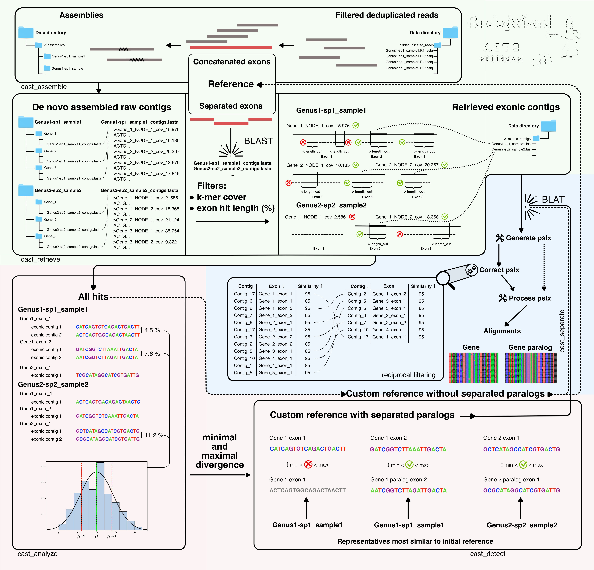

<pre> 
  _____                _          __          ___                  _ 
 |  __ \              | |         \ \        / (_)                | |              /\
 | |__) |_ _ _ __ __ _| | ___   __ \ \  /\  / / _ ______ _ _ __ __| |             /  \
 |  ___/ _` | '__/ _` | |/ _ \ / _` \ \/  \/ / | |_  / _` | '__/ _` |            |    |
 | |  | (_| | | | (_| | | (_) | (_| |\  /\  /  | |/ / (_| | | | (_| |          --:'''':--
 |_|   \__,_|_|  \__,_|_|\___/ \__, | \/  \/   |_/___\__,_|_|  \__,_|            :'_' :
                               |___/                                             _:"":\___
                                                                 ' '      ____.' :::     '._
                                                                . *=====<<=)           \    :
                                                                 .  '      '-'-'\_      /'._.'
                                                                                  \====:_ ""
                 _      ___   _____    ___                                       .'     \\
                /_\    / __| |_   _|  / __|                                     :       :
               / _ \  | (__    | |   | (_ |                                    /   :    \
              /_/ \_\  \___|   |_|    \___|                                   :   .      '.
                                                              ,. _            :  : :      :
           .   .-. .-.   .-. .-.   .-. .-.   .             '-' _  ).          :__:-:__.;--'
           |\ /|||\|||\ /|||\|||\ /|||\|||\ /|           (   _|  _  )        '-'   '-'
           ||\|||/ \|||\|||/ \|||\|||/ \|||\||        ( -  _| |_|   -_
           -~ `-~   `-~ `-`   `-~ `-`   `-~ `-       (   _| |_  |_    )
                                                     '-   |_         -</pre>
---
# Dependencies
  * [Python 3.6 or later](https://www.python.org/downloads/)
  * [BIOPYTHON 1.77 or later](https://biopython.org/wiki/Download)
  * [BLAST command line tools 2.2.30 or later](https://www.ncbi.nlm.nih.gov/books/NBK131777/#_Blast_ReleaseNotes_BLAST_2_2_30_October_)
  * [NumPy](https://numpy.org)
  * [Scikit-learn](https://scikit-learn.org/stable/user_guide.html)
  * [SciPy](https://www.scipy.org)
  * [Matplotlib](https://matplotlib.org)
  * [MAFFT 6.9 or later](https://mafft.cbrc.jp/alignment/software/)
  * [FastTree 2.0.0 or later](http://www.microbesonline.org/fasttree/)
  * [BLAT](http://genome.ucsc.edu/goldenPath/help/blatSpec.html)
  * [SPAdes](http://cab.spbu.ru/software/spades/)
  * [GNU Parallel](http://www.gnu.org/software/parallel/) 
  * [BWA](https://github.com/lh3/bwa)
  * [samtools 1.2 or later](https://github.com/samtools/samtools)



---
# Data structure

<pre>
Working_directory
    |_____Data_folder
    |         |_____10deduplicated_reads
    |         |_____20assemblies
    |         |_____30raw_contigs
    |         |_____31exonic_contigs
    |         |_____40aln_orth_par
    |         |_____41detected_par
    |         |_____50pslx
    |         |_____60mafft
    |         |_____70concatenated_exon_alignments
    |_____ParalogWizard
    |_____ParalogWizard.py
    |_____probes_concatenated_exons.fasta
    |_____probes_separated_exons.fasta
</pre>
---
# Input

* Trimmed, filtered and deduplicated pair-end reads are stored in 10deduplicated_reads folder together with list of samples called ```samples_list.txt```. All names and IDs shoud contain only letters and numbers. 

<pre>
10deduplicated_reads
    |_____Genus1-species1_ID.R1.fastq
    |_____Genus1-species1_ID.R2.fastq
    |_____Genus2-species1_ID.R1.fastq
    |_____Genus2-species1_ID.R2.fastq
    |_____Genus2-species2_ID.R1.fastq
    |_____Genus2-species2_ID.R2.fastq
    ...
    |_____samples_list.txt
</pre>

List of samples must have names of the samples which correspond to fastq files, one per each line with empy line in the end.
```    
    Genus1-species1_ID
    Genus2-species1_ID
    Genus2-species2_ID
    ...
    
```

* Two probe files: one containing sequences which are concatendated exons, another - with the same sequences separated to exons. Both files should have same names for the same gene. All names shoud contain only letters and numbers.
```
    >Representative1-Gene1
    >Representative1-Gene2
    >Representative2-Gene3
    ...
 ```

```
    >Representative1-Gene1_exon_1
    >Representative1-Gene1_exon_2
    >Representative1-Gene2_exon_1
    >Representative2-Gene3_exon_2
    >Representative2-Gene3_exon_4
    ...
```

---
# Local usage


```python3 ParalogWizard.py cast_assemlble -pr <bait file>  [-np <executing command without GNU Parallel>] ```

This part of PW is a simplified code of HybPiper pipeline and includes only mapping with bwa and assembly with spades. Takes de-duplicated and filtered reads from ```10deduplicated_reads``` and saves assemblies to ```20assemblies``` with original HybPipers' sub-folder structure.

```python3 ParalogWizard.py cast_retrieve -d <folder with data> -pe <probe file with separated exons> [-c <collect/recollect raw contigs][-l threshold for length cover of BLAST hits] [-s <threshold for k-mer cover of contigs assembled by SPAdes>] [-nc <number of cores>]```

Collects contigs assembled by SPAdes to folder ```30raw_contigs```. Matches retrieved contigs to the probe file with individual separated exons with BLAST, extracts exonic contigs according to hits and stores them in folder ```31exonic_contigs``` within the main folder with ParalogWizards results. Hit tables and statistics with assumed number of copies for each locus per sample are saved alongside.

```-nc``` — option to indicated number of used cores. Default 1.


```python3 ParalogWizard.py cast_analyze -d <folder with data> [-b <list of taxa excluded from paralog divergence estimation>] [-nc <number of cores>]```

Builds alignments for each exon with all exonic contigs retrieved for this exon and saves them to ```40aln_orth_par```, then calculates divergences between alternative contigs within each samples and combines these divergencies to global distribution. 

```-b``` — option to exclude samples from paralog divergence estimation and creation of a custom reference with or without paralogs. Names of samples should be provided exactly as in the list of samples in ```10deduplicated_reads```. When used, at least one sample has to be provided.

```-nc``` — option to indicated number of used cores. Default 1.

```python3 ParalogWizard.py cast_detect -d <folder with data> -pe <probe file with separated exons> [-b <list of taxa excluded from new reference creation>] [-p -mi <minimum paralog divergence> -ma <maximum paralog divergence>] ``` 

```python3 ParalogWizard.py cast_separate -d <folder with data> -pp <probe file with separated paralogs> -i <minimum identity for BLAT> [-r <list of taxa excluded from paralogs separation, ie included in all alignments in case of >]```


---
# Metacentrum usage

<pre>
[server]
   |_____home/[logname]       
                  |_____Working_directory
                  |          |_____Data_folder
                  |          |         |_____10deduplicated_reads
                  |          |         |_____20assemblies
                  |          |         |_____30raw_contigs
                  |          |         |_____31exonic_contigs
                  |          |         |_____40aln_orth_par
                  |          |         |_____41detected_par
                  |          |         |_____50pslx
                  |          |         |_____60mafft
                  |          |         |_____70concatenated_exon_alignments
                  |          |
                  |          |_____ParalogWizard_1a_CastSubmitAssemble.sh
                  |          |_____ParalogWizard_1a_CastSubmitAssemble_submitter.sh
                  |          |_____ParalogWizard_1b_CastSubmitRetrieve.sh
                  |          |_____ParalogWizard_2_CastSubmitAnalyze.sh
                  |          |_____ParalogWizard_3_CastSubmitSeparate.sh
                  |          |_____ParalogWizard_Settings.cfg
                  |
                  |_____HybSeqSource
                            |_____ParalogWizard
                            |_____ParalogWizard.py
                            |_____probes_concatenated_exons.fasta
                            |_____probes_separated_exons.fasta
                            |_____custom_reference_with_separated_paralogs.fasta

</pre>

### Settings

```data``` — path to data directory as [Working directory]/[Data directory] (see data structure above) within home directory on a particular server

```probe_exons_split``` — name of the reference file with split exons; value for ```-pe``` option of ```cast_retrieve``` command 

```probe_exons_concat``` — name of the reference file with concatenated exons; value for ```-pr``` option of ```cast_assemble``` command 

```exon_length``` — minimum exon length accepted to analysis

```server``` — Metacentrum server with all used directories

```collect_contigs``` — ```"yes"``` if needed to collect assemblies from ```20assemblies``` to ```30raw_contigs``` otherwise ```"no"``` or empty, after each assembly run can be done only once, contigs need to be recollected only when assembly step is modified; value for ```-c``` option of ```cast_retrieve``` command 

```length_cut``` — blast hit length filter (in %) during retrieving step ; value for ```-l``` option of ```cast_retrieve``` command 

```spades_cover_cut``` — k-mer cover filter (int) during retrieving step; value for ```-s``` option of ```cast_retrieve``` command 

```blocklist``` — list of samples excluded from paralog divergence estimation and creation of a custom reference with or without paralogs separated by space and enclosed in quotation marks; value for ```-b``` option of ```cast_analyze``` and ```cast_detect``` commands

```redlist``` — list of samples supposedly diverged before the event of WGD and, therefore, originally lacking paralogs associated with WGD; if single copy, sequences of samples from redlist are included into both alignments of separated paralogs (i.e. identical sequences present in both copies' alignments) in contrast to cases with gene loss after WGD (such sequences are included into only one alignment where they fit better); value for ```-r``` option of ```cast_retrieve``` command

```paralogs``` — ```"yes"``` for work with paralogs, ```"no"``` will generate customized reference to produce correct orthologous alignments; value for ```-p``` option of ```cast_detect``` command

```paralog_min_divergence``` — minimum divergence between copies for paralogs search; value for ```-mi``` option of ```cast_detect``` command

```paralog_max_divergence``` — maximum divergence between copies for paralogs search;value for ```-ma``` option of ```cast_detect``` command

```probes``` — customized reference generated by ```cast_detect``` and saved in ```41detected_par``` or ```41without_par```; value for ```-pc``` option of ```cast_separate``` command

```minident``` — minimum identity for BLAT during separation step; value for ```-i``` option of ```cast_separate``` command

### Assembly

```ParalogWizard_1a_CastSubmitAssemble_subitter.sh``` — submits ```ParalogWizard_1a_CastSubmitAssemble.sh``` for each sample as a separate job according to the sample list in ```10deduplicated_reads```.

```ParalogWizard_1a_CastSubmitAssemble.sh``` — executes ```cast_assemble``` command with options according to settings set in ```ParalogWizard_Settings.cfg```

### Retrieving 
```ParalogWizard_1b_CastSubmitRetrieve.sh``` — executes ```cast_retrieve``` command with options according to settings set in ```ParalogWizard_Settings.cfg```

### Paralog detection

```ParalogWizard_2a_CastSubmitAnalyze.sh``` — executes ```cast_analyze``` command with options according to settings set in ```ParalogWizard_Settings.cfg```

This step can be skipped in case of working without paralogs (paralogs="no")

```ParalogWizard_2b_CastSubmitDetect.sh``` — executes ```cast_detect``` command with options according to settings set in ```ParalogWizard_Settings.cfg```
In case of work without paralogs, this step will create customized reference without paralogs separated.

### Creating orthologous alignments

```ParalogWizard_2b_CastSubmitSeparate.sh``` — executes ```cast_separate``` command with options according to settings set in ```ParalogWizard_Settings.cfg```
Before this step, customized reference with or without separated paralogs must be copied to HybSeqSource folder


